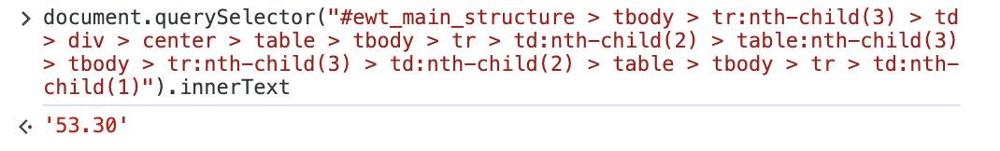

# Web Scraping Demo with `selenium`

see https://selenium-python.readthedocs.io/

### 1. why selenium?

There are two types of websites: **static websites** and **dynamic websites**. 

A static website is composed of fixed HTML and it displays the same content for every user, everytime. While a dynamic website displays different content to different users based on certain parameters or inputs. 

For static websites, you can use `requests.get()` to get the content. But we cannot do so for some dynamic websites, since programs (e.g. JavaScript, PHP) "dynamically" changes their content after the first request.

Here is an example. Now, you want corpus data of some Thai words. Enter this site and search one word.
https://www.arts.chula.ac.th/ling/tnc3/

But `requests.get()` cannot handle operations such as click. Moreover, nothing changes in `View Source` of Google Chrome (**Ctrl+U** for Windows, **⌘-Option-U** for Mac)

Therefore, we need a actual browser which can be operated by Python. `selenium` enables us to do automated operation on browser.

### 2. preparation

`selenium` is available for many browsers such as Chrome, Edge, Firefox. Here, we use Chrome. (But personally, I recommend Firefox)  

- install `selenium`
    
    - `$pip install selenium`

- check the version of Chrome. (in `About Google Chrome` menu)

- download `chromedriver` from here 

    - https://chromedriver.chromium.org/downloads (version 114 or older)

    - https://googlechromelabs.github.io/chrome-for-testing/ (version 115 or newer)

    

- extract the zip file and run `chromedriver` once.

    - for Mac, I recommend you put in `usr/local/bin` so that you don't have to specify the filepath.

### 3. how to find elements

It is necessary to combine JavaScript operations and python programs. In addition, you should be familiar with either **CSS selector** or **Xpath** to extract data from HTML. (I usually use CSS selector)

**Using CSS Selectors For Web Scraping**
https://www.scrapingbee.com/blog/using-css-selectors-for-web-scraping/

sample page : **Rubber Authority of Thailand**
https://www.raot.co.th/rubber2012/menu5.php

Open developer tools by `F12` key.

Right click one value in the table, and click `inspect`

The place of the element is shown in the right window.

Right click, and `copy` > `Copy selector`

Go to `Console` menu, paste copied CSS selecor and run JavaScript commands `document.querySelector()`. You can get the text by `innerText` attribute. This CSS selector can be used also in `BeautifulSoup`, by using `soup.select_one()` method. (see example code)

~~~
> document.querySelector("<paste here>").innerText
~~~

In order to click the button, you have to run JavaScript command. Then, let's find the selector of GO button.

In this case, a name is assigned to this button. So we can reach the element by `input[name=Submit]`

To click the element, use `.click()` method. Then, page transits.

~~~
> document.querySelector("input[name=Submit]").click()
~~~

### 4. frequently used functions

#### `BeautifulSoup`

- `soup.find()` : find one element by HTML tag
https://www.crummy.com/software/BeautifulSoup/bs4/doc/#find
- `soup.find_all()` : find all elements by HTML tag
https://www.crummy.com/software/BeautifulSoup/bs4/doc/#calling-a-tag-is-like-calling-find-all
- `soup.select_one()`, `soup.select()` : find one/all element(s) by CSS selector
https://www.crummy.com/software/BeautifulSoup/bs4/doc/#searching-by-css-class

or you can also use `.xxx` attribute for the first child. In the example below, `soup.a.text` returns string `link 1`, and `soup.a.get('href')` returns string `xxx`

~~~
<html>
<body>
<a href='xxx'>link 1</a>
<a href='yyy'>link 2</a>
</body>
</html>
~~~

#### `selenium`

- `driver.get()`
- `driver.page_source()`
- `driver.execute_script()` - run a JavaScript command
- `driver.find_element(By.xxx)`
    - I seldom use this method. 
    - if you want to scrape the data, to find the target element in `soup` is easier
    - if you want to do some action with the element, to combine `document.querySelector` and `driver.execute_script()` is more stable

#### `JavaScript`

- `document.getElementById()` - for the elements that have id 
- `document.querySelector()`
- `document.querySelectorAll()`
- `element.scrollIntoView()`
- `element.value`
- `element.click()`